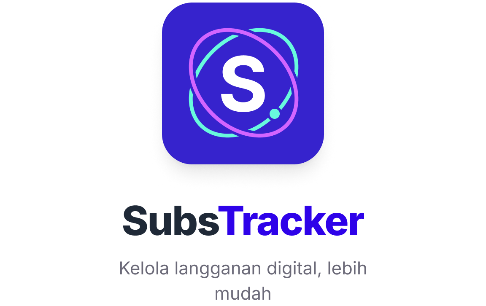

# 📱 SubsTracker

<p align="center">
  
</p>

<h3 align="center">SubsTracker Application</h3>

<p align="center">
  <strong>Aplikasi Pintar Pengelola dan Pelacak Langganan Digital</strong>
</p>

<p align="center">
  
  
  
  
</p>

---

## 🌟 Tentang SubsTracker

**SubsTracker** adalah aplikasi Android modern yang dirancang khusus untuk membantu Anda melacak, mengelola, dan mengoptimalkan pengeluaran langganan digital bulanan (seperti Netflix, Spotify, YouTube Premium, dll.) secara terpusat dalam satu aplikasi. Tidak ada lagi biaya tersembunyi atau lupa membatalkan langganan yang sudah tidak terpakai!

---

## ✨ Fitur Utama

*   📊 **Dashboard Ringkasan**: Pantau total biaya langganan bulanan Anda dalam sekejap.
*   ✏️ **Manajemen Langganan**: Tambah, edit, dan hapus langganan dengan detail lengkap (Harga, Kategori, Siklus).
*   🏷️ **Kategorisasi Cerdas**: Pengelompokan langganan berdasarkan kategori (Hiburan, Produktivitas, Pendidikan, dll.).
*   🔄 **Siklus Fleksibel**: Mendukung siklus penagihan harian, mingguan, bulanan, hingga tahunan.
*   🔔 **Notifikasi Pengingat**: Terima notifikasi otomatis sebelum tanggal penagihan jatuh tempo dengan waktu reminder yang bisa disesuaikan (H-1, H-2, H-3, H-7).
*   🎨 **Desain UI Premium**: Antarmuka pengguna modern dengan palet warna lavender yang estetik dan tata letak yang bersih sesuai spesifikasi Figma.

---

## 🛠️ Stack Teknologi

Aplikasi ini dibangun menggunakan arsitektur dan pustaka terbaik untuk ekosistem Android:

| Komponen | Pustaka / Teknologi | Keterangan |
| :--- | :--- | :--- |
| **Bahasa Utama** | Kotlin | Menjamin kode yang ekspresif, ringkas, dan aman. |
| **User Interface** | XML Layouts & Material Design | Komponen UI modern, dinamis, dan responsif. |
| **Database Lokal** | Room Persistence | Menyimpan data langganan secara aman dan *offline-first*. |
| **Arsitektur** | MVVM (Model-View-ViewModel) | Memisahkan logika bisnis dengan presentasi UI agar mudah dirawat. |
| **Navigasi** | Jetpack Navigation Component | Memudahkan transisi antar layar menggunakan graf navigasi XML. |
| **Binding** | View Binding | Menggantikan `findViewById` untuk interaksi UI yang aman. |

---

## 📐 Arsitektur Proyek (MVVM)

SubsTracker mengimplementasikan pola arsitektur **MVVM (Model-View-ViewModel)** dengan struktur folder sebagai berikut:

```
app/src/main/java/com/example/uasad/
│
├── data/             # Layer Data (Entity, DAO, Database, Repository)
│   ├── local/        # Konfigurasi Database Room
│   └── Subscription.kt
│
├── home/             # Tampilan & ViewModel Dashboard Home
├── list/             # Tampilan & ViewModel Daftar Langganan
├── detail/           # Detail Informasi Langganan
├── addedit/          # Formulir Tambah & Edit Langganan
└── settings/         # Konfigurasi Pengingat & Info Aplikasi
```

---

## 🚀 Panduan Memulai

Ikuti langkah-langkah di bawah ini untuk menjalankan SubsTracker di lingkungan lokal Anda:

### Prasyarat
*   **Android Studio** (Versi Ladybug atau yang lebih baru direkomendasikan).
*   **JDK 17** atau yang lebih baru.
*   Perangkat fisik Android atau Emulator (API level 26+ direkomendasikan).

### Langkah Instalasi
1.  **Clone Repository**
    ```bash
    git clone https://github.com/username/substracker.git
    ```
2.  **Buka Proyek**
    *   Buka Android Studio.
    *   Pilih **Open an Existing Project** dan arahkan ke folder root hasil clone proyek ini.
3.  **Sync Gradle**
    *   Tunggu hingga proses sinkronisasi Gradle selesai secara otomatis.
4.  **Run Aplikasi**
    *   Hubungkan perangkat fisik Anda atau jalankan Emulator.
    *   Klik tombol **Run** (icon play hijau) di toolbar atas Android Studio.

---

## 📄 Lisensi

Proyek ini dirancang untuk keperluan akademik dan pengembangan internal. 

```
© 2026 SubsTracker Team. All rights reserved.
```
